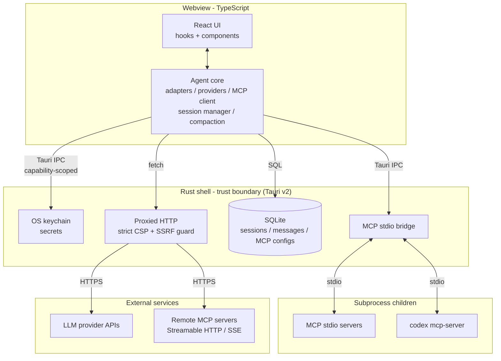
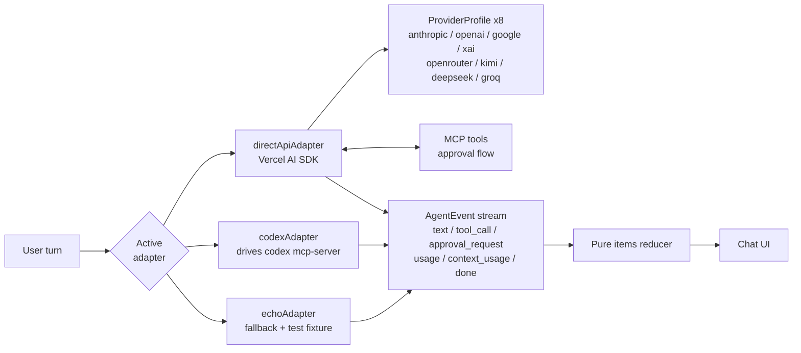

# Delphy Agent

A desktop-first **agent hub** that gives you one interface to drive multiple AI backends — agent CLIs (Codex today; Claude Code planned) and direct LLM APIs (Claude, OpenAI, Gemini, xAI, OpenRouter, Kimi, DeepSeek, Groq) — and extends every backend through **MCP-based plugins**. Built with Tauri v2, React 19, and TypeScript.

> **Pre-v1, but well past prototype.** Multi-provider direct-API chat, MCP plugins (local + remote), SQLite session persistence, context compaction, and a theme system are all working. No release builds, code signing, or auto-updater yet — see [Status and stability](#status-and-stability).

## Why it exists

There is no one model, no one agent, and no one tool that wins for every task. Users should be able to pick the right backend per moment and extend any of them through a standard plugin protocol. Delphy Agent is the shell that makes that possible.

It's also becoming an **AI-native way to browse and interact with the web**: you express intent in plain language, the agent does the discovery and the reaching-out, and results return as rich native views rather than walls of text. The web is addressed through structure agents understand — registries, MCP capabilities, manifests — not scraped HTML.

The full vision and the eleven principles live in [docs/VISION.md](docs/VISION.md). The first three — security-first, token-frugal, speed — are non-negotiable quality bars.

## What works today

- **Multi-provider direct-API chat** — 8 providers via the Vercel AI SDK behind a per-provider `ProviderProfile`: native `anthropic` / `openai` / `google` / `xai`, first-class OpenAI-compatible `openrouter` / `kimi` / `deepseek` / `groq`, plus a generic Custom OpenAI-compatible profile. Real token streaming, (Provider, Model) pickers, lazy model discovery.
- **Codex backend (Slice A)** — drives `codex mcp-server` over the MCP bridge as a second backend (read-only turn loop; selectable via a Settings toggle). Claude Code is deferred.
- **MCP plugins, fully wired** — Rust stdio bridge for local servers plus remote transports (Streamable HTTP + legacy SSE), tool calls with an approval flow, CRUD management and per-tool enable/disable from the Settings UI. Secrets are referenced via `${secret:<key>}` placeholders, never inlined.
- **SQLite session persistence** — sessions persist incrementally and resume on boot; a session sidebar lists and switches between them. A built-in `update_memory` tool gives the agent durable memory across sessions.
- **Context compaction** — structured head/middle/tail auto-compaction plus a manual `/compact`, with a `/status` command for token/cost accounting.
- **Three-tier system prompt**, OS-keychain secret store, a 6-theme system with live reload, and tabbed Settings (Providers / Models / Plugins / Appearance).

## Quick start

Prerequisites:

- **Node 24** (see `.nvmrc`)
- **pnpm** (`npm install -g pnpm` or via Corepack)
- **Rust toolchain** (`rustup` — Tauri builds the native shell)
- Platform-specific Tauri dependencies — see the [Tauri v2 prerequisites guide](https://v2.tauri.app/start/prerequisites/)

```bash
pnpm install
pnpm tauri:dev      # full Tauri dev (native window)
# or
pnpm dev            # webview-only Vite dev (no native window)
```

Other useful commands:

| Command | Purpose |
|---|---|
| `pnpm build` | Frontend production bundle (`tsc && vite build`) |
| `pnpm test` | Run Vitest suite once |
| `pnpm lint` | Biome lint + format check |
| `pnpm typecheck` | `tsc --noEmit` |
| `cargo check --manifest-path src-tauri/Cargo.toml` | Rust type check |
| `cargo clippy --manifest-path src-tauri/Cargo.toml -- -D warnings` | Rust lints |

## How it's built

Tauri v2 (Rust shell) + React 19 + TypeScript + Tailwind v4 + shadcn in the webview. Most logic lives in TypeScript; the Rust side is a thin layer for system access (OS keychain, MCP stdio bridge, theme file watching).

The Rust shell is the **trust boundary**: secrets stay in the OS keychain, subprocesses are spawned only by Rust, and all network egress leaves through a Rust-proxied HTTP layer behind a strict CSP and an SSRF guard. The webview never holds a raw capability.



Each backend is an **adapter** exposing the same contract — it accepts a turn and emits a stream of `AgentEvent`s (text deltas, tool calls, token usage, lifecycle). Three adapters are registered today: `directApiAdapter` (multi-provider), `codexAdapter` (Codex), and `echoAdapter` (boot fallback + test fixture). The active backend is chosen in Settings. MCP plugins attach to any active backend.



### Repository layout

```
src/                         React + TypeScript webview
  App.tsx                    ~450-line shell composing hooks + presentational components
  hooks/                     use-{session,mcp-servers,providers,themes,chat-scroll}
  components/                presentational UI (chat-stream, composer, settings-modal, ...) + ui/ (shadcn)
  core/
    adapters/                direct-api, codex, echo + registry
    providers/               8 ProviderProfiles + model discovery cache
    codex/                   Codex adapter internals (connect, session, events)
    mcp/                     MCP client, transport factory (stdio/http/sse), manager
    db/                      SQLite layer (sessions, messages, memory, mcp_servers)
    chat/                    pure event reducer + item projection
    prompts/                 three-tier system prompt + compaction
    boot.ts                  app bootstrap and adapter routing
src-tauri/src/               Rust shell: lib.rs, mcp_bridge.rs, secrets.rs, themes.rs
docs/                        VISION, ARCHITECTURE, SPEC, THEMES, DECISIONS, ...
```

For the full architectural picture, read [docs/ARCHITECTURE.md](docs/ARCHITECTURE.md). For external contracts (MCP config shape, settings file, session export, theme JSON), [docs/SPEC.md](docs/SPEC.md).

## What does not exist yet

This is honest scoping, not a roadmap.

- **Claude Code backend** — deferred; `claude mcp serve` exposes tools, not a driveable agent (see [docs/DECISIONS.md](docs/DECISIONS.md) 2026-05-26).
- **Codex Slice B/C** — current Codex support is read-only; approvals + `workspace-write` sandbox and feeding Codex the user's MCP servers are pending.
- **OAuth-authed remote MCP** — remote transports ship with static header/bearer auth only; OAuth and WebSocket transport are not implemented.
- **Progressive tool disclosure** — per-tool enable/disable ships (Settings → Plugins), but every *enabled* tool's schema still loads each turn; tool-search indirection is deferred until tool counts warrant it.
- **Local / no-key providers** (Ollama, LM Studio) and a Custom-profile base-URL edit UI — the Custom profile is currently configured via the settings file only. No non-(key+baseURL) auth (e.g. AWS Bedrock SigV4).
- **Code signing, notarization, auto-updater** — none yet (CI gates lint/typecheck/test/build + cargo on every push).

See [docs/DECISIONS.md](docs/DECISIONS.md) for what's been decided and why; [docs/ARCHITECTURE.md](docs/ARCHITECTURE.md) § "Open questions" for what hasn't.

## Contributing

Contributions welcome. Read [CONTRIBUTING.md](CONTRIBUTING.md) before opening a PR — the project follows a plan → build → review workflow described in [BLUEPRINT.md](BLUEPRINT.md), and design decisions are recorded in [docs/DECISIONS.md](docs/DECISIONS.md).

## Security

Found a vulnerability? See [SECURITY.md](SECURITY.md) — please do **not** open a public issue.

## Status and stability

This is not production software. No release builds yet. APIs, storage schemas, and UI surfaces will change without migration support until v1.

## License

MIT — see [LICENSE](LICENSE).
